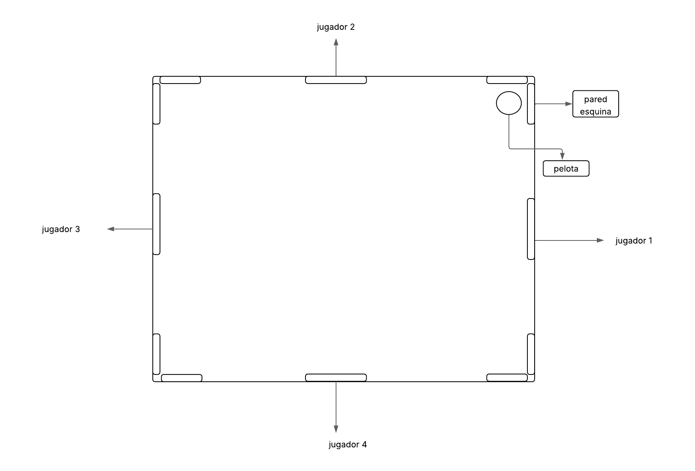

# 🏓 Pong 4 Jugadores

Un juego multijugador local tipo "Pong" para 4 jugadores, diseñado para escritorio y dispositivos móviles. Cada jugador controla una paleta en un lado del tablero, defendiendo su área y tratando de eliminar a los demás.

---

## 🎮 Mecánicas del Juego

- **Jugadores**: Hasta 4 jugadores pueden participar.
- **Controles por jugador**:
  - Jugador 1 (derecha): `J` y `L`
  - Jugador 2 (arriba): `←` y `→`
  - Jugador 3 (izquierda): `W` y `S`
  - Jugador 4 (abajo): `A` y `D`
- **Móviles**: Las paletas se pueden arrastrar con el dedo (touch drag).
- **Objetivo**: Cada jugador tiene 5 vidas. Cuando la pelota entra por su lado, pierde una vida. Cuando llega a 0, su arco se bloquea.
- **Ganador**: El último jugador con vidas gana.

---

## 📱 Compatibilidad

- 💻 Escritorio (teclado)
- 📱 Móvil (touch drag)

---

## 🧩 Arquitectura Modular

El código está dividido en los siguientes módulos:

- `index.html` – estructura base
- `style.css` – estilos
- `game.js` – lógica del juego
- `input.js` – controles de teclado y touch
- `resize.js` – escalado dinámico del canvas
- `ui.js` – pantallas de inicio/fin, nombres de jugadores

---

## 🖼️ Diagrama del Juego



---

## 🚀 Cómo iniciar

```bash
# Clonar el repositorio
git clone https://github.com/tu-usuario/pong4.git

# Abrir el archivo en navegador (usar Live Server o abrir index.html)
